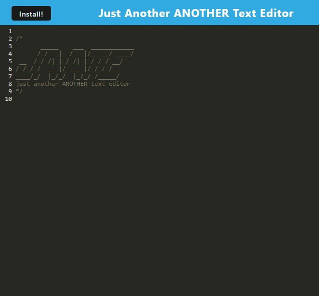

# Just Another ANOTHER Text Editor
  
  
  
## Description

This is a simple text editor web app.  I made this to test working with web apps, specifically webpacks.  Webpacks can be rather annoying to work with, but they do provide very useful utilites.  If you have a good text editor this won't change your life, however it is nice to have another one that'll always have quick extra notes to use whenever I may need them.

## Table of Contents

  - [Description](#description)
  - [Table of Contents](#table-of-contents)
  - [Installation](#installation)
  - [Usage](#usage)
  - [Contribution Guidelines](#contribution-guidelines)
  - [Testing Instructions](#testing-instructions)
  - [License](#license)
  - [Questions](#questions)

## Installation

Clone the repo and run `npm i` then run `npm start dev`. The web app with be hosted at localhost:3000

## Usage

Text editor that you can download for offline use and stores data written in it.

[Test the app here.](https://parker-text-editor.herokuapp.com/)

## Contribution Guidelines

No contributions needed at this time.

## Testing Instructions

No testing needed at this time.

## License

I am using the [MIT License](https://choosealicense.com/licenses/mit/)

## Questions

Any questions you may have you can contact me here:
- GitHub Profile: [ParksFG](https://github.com/ParksFG)
- Email: parkerfgay@gmail.com
